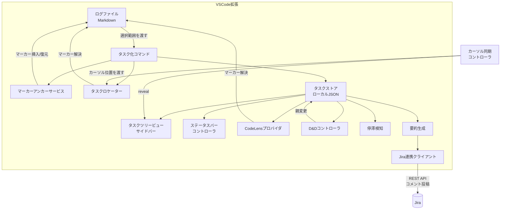
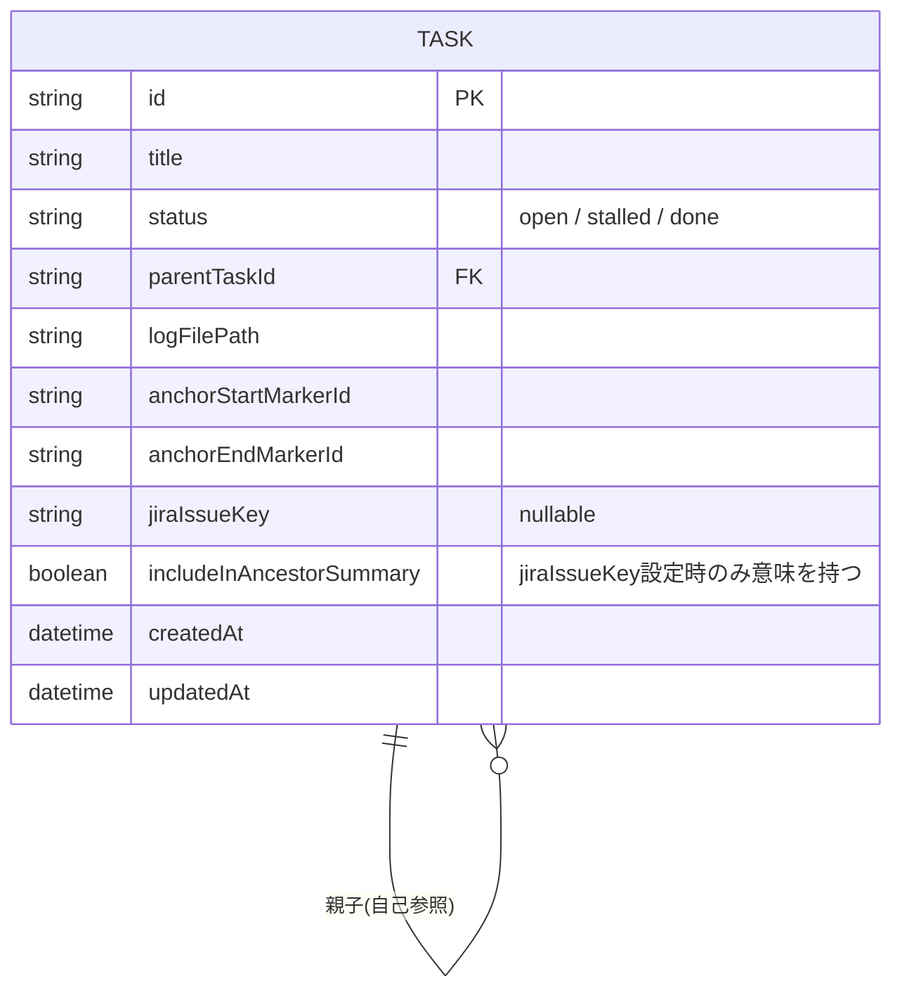
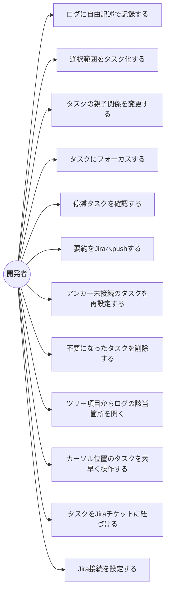

# 機能設計書

## 1. 機能ごとのアーキテクチャ

本ツールはVSCode拡張として動作し、以下の要素で構成される。

- **ログエディタ**:VSCode標準のテキストエディタ機能をそのまま利用する。専用のエディタUIは持たず、素のMarkdownファイルを編集するだけ
- **タスクストア**:タスクのメタデータ(タイトル、親子関係、ステータス、最終更新日時、参照アンカー、紐づくJiraチケットなど)を、ワークスペースのディレクトリ(リポジトリ)の外にあるVSCode拡張専用のストレージ領域に、ワークスペースごとに分離して保持する
- **マーカーアンカーサービス**:ログ内のテキスト選択範囲とタスクを結びつけるため、選択範囲の先頭と末尾を挟む形で開始・終了のMarkdownコメント形式マーカーを挿入し、タスク側からその範囲を復元する。範囲全体を継続的に特定できるため、タスク化後にユーザーがその範囲の内容を書き足したり修正したりしても、要約生成時には常に現在の内容を参照できる
- **タスクロケーター**:ログのテキストと行範囲から、その範囲を完全に含む最も内側のタスクを求める。カーソル位置に対応するタスクの特定(ツリーのハイライト、カーソル位置でのステータス切替)と、新規タスク作成時の親のデフォルト決定(既存タスクのマーカー範囲内であれば、そのタスクを親にする)の両方で使う共通ロジック
- **タスクツリービュー**:サイドバーにタスクの親子構造を表示する。項目のクリックでログの該当箇所を開き、ドラッグ&ドロップで親を変更できる。カーソル位置に対応する項目は自動的にハイライト(reveal)されるが、これは表示のみでフォーカスには影響しない
- **ステータスバーコントローラ**:現在フォーカスしているタスクのパンくず(親子の連なり)を表示する
- **停滞検知**:各タスクの最終更新日時を監視し、設定した閾値を超えたタスクをツリービュー上で視覚的に警告表示する
- **要約生成**:指定タスクの配下のタスクツリーから、タイトルとステータスを階層構造が分かるインデント付きテキストとして組み立てる。ログ本文の抜粋やAIによる自然文要約は行わない(ロジックを単純に保ち、外部API依存を増やさないため)
- **Jira連携**:生成した要約をエディタでプレビューし、確認・編集した上で、タスクに紐づけられた既存のJiraチケットへコメントとして投稿する。Jira側にサブタスクやチケットを新規作成することはない

## 2. システム構成図



## 3. データモデル定義



- `id`はタスクを一意に識別するIDであり、ユビキタス言語定義における「タスクID」に対応する。同名タスクが複数存在する場合に区別できるよう、タスク選択のUI(QuickPick等)ではタイトルと共にタスクIDの先頭部分(短縮ID)を併記する
- `TASK.parentTaskId`により親子関係を表現する。ルートタスク(親を持たないタスク)にJiraチケットキーを紐づけるのが基本形だが、任意の階層のタスクに個別に紐づけることも許容する
- `anchorStartMarkerId`・`anchorEndMarkerId`は、ログファイル内に埋め込まれた開始・終了マーカーコメントのIDと対応する。この2つに挟まれた範囲が、タスクが参照するログ内容となる。いずれかのマーカーが削除・欠落した場合、タスクは「アンカー未接続」状態としてツリービュー上で識別可能にする(参照先の手動再設定を促す)
- `updatedAt`は、タスク自体のステータス変更操作、または紐づくログ内容への追記操作によって更新される
- `includeInAncestorSummary`は、祖先とは異なる`jiraIssueKey`を持つ部分木にのみ意味を持つ属性で、この部分木の内容を祖先チケットの要約にも含めるかを制御する(詳細は7章)

## 4. コンポーネント設計

| コンポーネント | 役割 |
|---|---|
| Extension Host | 拡張の起動、各コマンド・Viewの登録 |
| MarkerAnchorService | 選択範囲近傍へのマーカー挿入、マーカーからのログ位置解決 |
| TaskLocator | 行範囲を完全に含む最も内側のタスクを、ログテキストと候補タスク一覧から求める。カーソル位置の特定と、作成時の親のデフォルト決定の両方で使う |
| TaskStore | タスクメタデータの永続化・CRUD、ワークスペースのディレクトリ外にあるVSCode拡張専用ストレージ領域のJSONファイルで管理 |
| TaskTreeViewProvider | サイドバーのTreeView描画。項目クリックでログの該当箇所を開く |
| TaskTreeDragAndDropController | タスクツリー上のドラッグ&ドロップで親を変更する。兄弟間の並び替えは扱わない |
| CursorSyncController | カーソル位置に対応するタスクをTaskLocatorで求め、タスクツリー上でハイライト(reveal)する。表示のみでフォーカスには影響しない |
| StatusBarController | フォーカス中タスクのパンくず表示、フォーカス切り替え |
| TaskCodeLensProvider | ログ編集中、マーカー範囲の直上に対応するタスク名をCodeLensとして表示し、クリックでそのタスクにフォーカスする。編集中は常にタスクツリーを見ているとは限らないため、エディタ側からもマーカーとタスクの対応が分かるようにする |
| StallDetector | `updatedAt`を定期的に監視し、閾値超過タスクを検出してTreeViewへ反映 |
| SummaryGenerator | 指定タスク配下のタスクツリーから、タイトルとステータスの階層テキストを組み立てる(`buildSummary`)。`includeInAncestorSummary`が偽の部分木は除外する |
| JiraClient | Jira REST APIを用いたチケット存在確認・サマリ取得・コメント投稿。`{ baseUrl, email, apiToken }`を値として受け取るのみで、設定の取得元(拡張設定・SecretStorage)は関知しない |
| getJiraClient | 拡張設定(`taskLog.jira.baseUrl`・`taskLog.jira.email`)とSecretStorageのAPIトークンから`JiraClient`を組み立てる関数。呼ぶたびに現在の設定・トークンを読み直す。未設定時はエラーメッセージを表示する |

### 主なコマンド

タスクの作成・編成に関する基本操作:

- `taskLog.createTaskFromSelection`:選択範囲の先頭・末尾に開始・終了マーカーを挿入してタスクを作成(参照型)。実行時、選択範囲の先頭部分から自動生成されたタイトル案を入力ボックスに表示し、そのままEnterで確定するか、その場で編集できる。事後的にツリービューからタイトルを変更することも可能
- `taskLog.setParent`:既存タスクの親を変更
- `taskLog.setFocus` / `taskLog.clearFocus`:フォーカス中タスクの設定・解除
- `taskLog.markDone` / `taskLog.markOpen`:ステータス変更(完了 / 未完了)。タスクツリー項目のインラインボタン(ステータスに応じて表示されるアイコン)からも実行できる
- `taskLog.reanchorTask`:アンカー未接続になったタスクに対し、現在開いているログの新しい選択範囲へマーカーを挿入し直し、参照先を張り替える。対象選択の一覧はアンカー未接続のタスクのみに絞り込む(既に接続済みのタスクを誤って選び直す事故を避けるため)。接続済みのタスクが対象として渡された場合(将来的な右クリックメニュー経由等)は、張り替え前に確認を挟む
- `taskLog.deleteTask`:タスクを削除する。ログ本文・マーカーには一切触れない(マーカーは孤立した無害なコメントとして残る)。子タスクがある場合は、実行時に「子タスクを親の下へ昇格させる」か「子孫タスクごと再帰的に削除する」かを選択する
- `taskLog.revealTaskInEditor`:タスクのログファイルを開き、アンカー範囲の先頭にカーソルを移動する。タスクツリーの項目クリックから実行される
- `taskLog.toggleStatusAtCursor`:カーソル位置に対応するタスク(TaskLocatorで特定)のステータスをオープン⇔クローズで切り替える

Jiraとの連携に関する操作:

- `taskLog.setJiraApiToken`:Jira APIトークンをパスワード入力で受け取り、SecretStorageに保存する。JiraインスタンスのURL・メールアドレスは拡張設定(`taskLog.jira.baseUrl`・`taskLog.jira.email`)で入力する
- `taskLog.linkJiraIssue`:選択中のタスクにJiraチケットキーを紐づける。入力されたキーはAPIで存在確認し、取得したサマリをメッセージで表示する。既に祖先が別のJiraチケットに紐づいている場合は、この部分木を祖先の要約に「含める」か「含めない(独立)」かを併せて選択する(`includeInAncestorSummary`)
- `taskLog.pushSummaryToJira`:対象タスクの自身または祖先から`jiraIssueKey`を解決し、その配下の要約を生成する。生成結果はUntitledドキュメントとして開いてプレビューし、確認・編集した上で、非モーダルな確認メッセージから投稿を実行する

## 5. ユースケース



## 6. 画面イメージ(ワイヤーフレーム)

```
┌───────────────────────────────┬───────────────────────────┐
│ investigation.md               │ TASK TREE                 │
│                                 │ ▾ JIRA-123 委託先コード確認 │
│ <!-- tasklog:a1b2:start -->     │   ▾ ⚠ パラメータX変更の影響│
│  パラメータXを変更してビルド    │        └ ✓ ログ確認済み    │
│  → デプロイしたらエラー発生     │     ○ ライブラリバージョン差 │
│ <!-- tasklog:a1b2:end -->       │                            │
│                                 │                            │
│ <!-- tasklog:c3d4:start -->     │                            │
│  疑問: ライブラリのバージョン   │                            │
│  差異が原因では?                │                            │
│ <!-- tasklog:c3d4:end -->       │                            │
└───────────────────────────────┴───────────────────────────┘
 ステータスバー: 🔍 調査中: パラメータX変更の影響 (JIRA-123 > 深さ1)
```

- `⚠`:警告表示中のタスク(停滞検知、またはアンカー未接続)。現在の実装では両者を区別せず同じ記号を使っているため、将来的に見分けが必要になった場合はアイコンを分ける検討が必要
- `✓` / `○`:タスクのステータス(完了 / 未完了)

## 7. Jiraチケットとの紐付け、および要約生成範囲の解決ルール

### 紐付けの操作フロー
特別な「ルート作成」専用フローは用意せず、通常のタスク化操作を経てから紐づける。

1. ログに調査の起点となる一行(見出しなど)を書く
2. その範囲を選択して`taskLog.createTaskFromSelection`を実行し、通常通りタスクを作成する
3. 作成されたタスクに対して`taskLog.linkJiraIssue`を実行し、Jiraチケットキーを紐づける

「Jiraと紐づいたタスク」は特別な種類のタスクではなく、`jiraIssueKey`属性を持つタスクという位置づけであり、親子関係と同様、この紐付けもいつでも後から追加・変更できる。

### 要約push先の解決ルール(最も近い祖先を辿る)
あるタスクの要約をpushする際、そのタスク自身が`jiraIssueKey`を持たなければ、`jiraIssueKey`を持つ最も近い祖先を辿ってpush先を決定する。

### 部分木が祖先と異なるJiraチケットに紐づく場合
部分木を祖先とは別のJiraチケットに紐づけることを許容する(例:調査中に見つかった問題が別チケットの管轄である場合)。この際、`includeInAncestorSummary`により、祖先の要約生成にこの部分木を含めるかを選択する。

- **含めない(独立)**:この部分木は祖先の要約生成対象から除外される。「切り出し」の意図(この話はここで完結し、別チケットとして扱う)に対応する
- **含める**:祖先の要約生成時にもこの部分木の内容を含める。祖先チケットが複数の子チケットへの分割(MECEな分割)であり、祖先側で全体像の集約を必要とする場合に対応する

## 8. API設計(Jira連携)

- 認証:Jira APIトークンによるBasic認証(`email:apiToken`をBase64化)。APIトークン自体はVSCodeのSecretStorageに保存し、平文でファイルに残さない。JiraインスタンスのURL・メールアドレスは秘密情報ではないため、通常の拡張設定(`contributes.configuration`)で入力する
- 使用エンドポイント:
  - `GET /rest/api/3/issue/{issueIdOrKey}?fields=summary`(チケット紐づけ時の存在確認・サマリ取得)
  - `POST /rest/api/3/issue/{issueIdOrKey}/comment`(要約コメントの投稿)
- コメント本文の形式:Jira Cloud REST API v3はコメント本文にAtlassian Document Format(ADF、JSON形式のリッチテキスト表現)を要求する。本ツールは生成した要約テキスト全体を1つの`codeBlock`ノードとして送信する。これによりプレビューで見たインデント付きテキストが、そのままJira上にも表示される
- 本ツールからJira側へチケット・サブタスクの新規作成は行わない(コメント投稿のみ)
